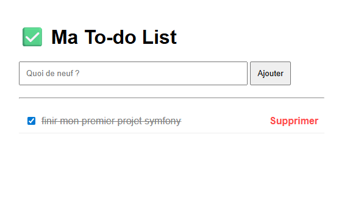

## 📸 Aperçu


# 📝 Todo App – Symfony

## 🚀 Description

Cette application est une **Todo List développée avec Symfony**, permettant aux utilisateurs de gérer leurs tâches quotidiennes de manière simple et efficace.

Ce projet a été réalisé dans le but de :

* découvrir et maîtriser le framework Symfony
* comprendre l’architecture MVC
* manipuler une base de données avec Doctrine
* se rapprocher des pratiques professionnelles utilisées en entreprise

---

## ⚙️ Fonctionnalités

* ✅ Création de tâches
* ✏️ Modification de tâches
* ❌ Suppression de tâches
* 📋 Affichage de la liste des tâches
* ✔️ Marquer une tâche comme terminée
* 🗄️ Stockage en base de données (SQLite)

---

## 🛠️ Technologies utilisées

* PHP
* Symfony
* Doctrine ORM
* Twig
* SQLite
* HTML / CSS

---

## 📁 Structure du projet

* `src/` : logique applicative (controllers, entities)
* `templates/` : vues Twig
* `config/` : configuration Symfony
* `public/` : point d’entrée de l’application

---

## 🧱 Base de données

L'application utilise **SQLite** avec Doctrine.

Entité principale :

* **Task**

  * title (string)
  * description (text, nullable)
  * isDone (boolean)
  * createdAt (datetime)

---

## ▶️ Installation

### 1. Cloner le projet

```bash
git clone https://github.com/ton-username/todo-app.git
cd todo-app
```

### 2. Installer les dépendances

```bash
composer install
```

### 3. Configurer la base de données

```bash
php bin/console doctrine:database:create
php bin/console doctrine:migrations:migrate
```

### 4. Lancer le serveur

```bash
symfony serve
```

Puis ouvrir :

```
http://localhost:8000
```

---

## 🎯 Objectifs pédagogiques

Ce projet m’a permis de :

* comprendre le fonctionnement d’un framework backend moderne
* utiliser Doctrine pour gérer une base de données
* générer rapidement des CRUD avec Symfony
* structurer une application web proprement
* manipuler des formulaires et des vues Twig

---

## 🚧 Améliorations possibles

* 🔐 Système d’authentification (login/register)
* 👤 Association des tâches à un utilisateur
* 🎨 Amélioration de l’interface (Bootstrap / Tailwind)
* 🌐 Déploiement en ligne
* 📱 Responsive design

---

## 📌 Auteur

Projet réalisé par **Riyad Ayoub** dans le cadre de mon apprentissage du développement web et de ma recherche d’alternance en BUT MMI.

---

## 💡 Remarque

Ce projet est une première approche de Symfony et a pour objectif de démontrer ma capacité à apprendre rapidement de nouvelles technologies et à développer une application fonctionnelle de bout en bout.

---
